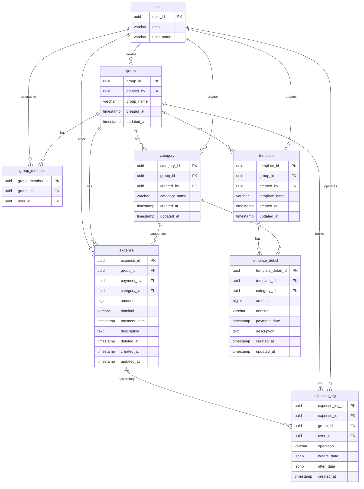

```mermaid
erDiagram
    user ||--o{ group : "creates"
    user ||--o{ group_member : "belongs to"
    group ||--o{ group_member : "has"
    user ||--o{ expense : "pays"
    group ||--o{ expense : "has"
    category ||--o{ expense : "categorizes"
    expense ||--o{ expense_log : "has history"
    group ||--o{ expense_log : "tracks"
    user ||--o{ expense_log : "operates"
    group ||--o{ category : "has"
    user ||--o{ category : "creates"
    group ||--o{ template : "has"
    user ||--o{ template : "creates"
    template ||--o{ template_detail : "has"
    category ||--o{ template_detail : "categorizes"

    user {
        uuid user_id PK
        varchar email
        varchar user_name
    }

    group {
        uuid group_id PK
        uuid created_by FK
        varchar group_name
        timestamp created_at
        timestamp updated_at
    }

    group_member {
        uuid group_member_id PK
        uuid group_id FK
        uuid user_id FK
    }

    expense {
        uuid expense_id PK
        uuid group_id FK
        uuid payment_by FK
        uuid category_id FK
        bigint amount
        varchar nominal
        timestamp payment_date
        text description
        timestamp deleted_at
        timestamp created_at
        timestamp updated_at
    }

    expense_log {
        uuid expense_log_id PK
        uuid expense_id FK
        uuid group_id FK
        uuid user_id FK
        varchar operation
        jsonb before_data
        jsonb after_data
        timestamp created_at
    }

    category {
        uuid category_id PK
        uuid group_id FK
        uuid created_by FK
        varchar category_name
        timestamp created_at
        timestamp updated_at
    }

    template {
        uuid template_id PK
        uuid group_id FK
        uuid created_by FK
        varchar template_name
        timestamp created_at
        timestamp updated_at
    }

    template_detail {
        uuid template_detail_id PK
        uuid template_id FK
        uuid category_id FK
        bigint amount
        varchar nominal
        timestamp payment_date
        text description
        timestamp created_at
        timestamp updated_at
    }
```